# **Portfolio Project 4 - Independent Informant**
## Simple smallscale community based news site - <a href="https://chrotesque-ci-portfolio-4.herokuapp.com/" target="_blank">View deployed site here.</a>

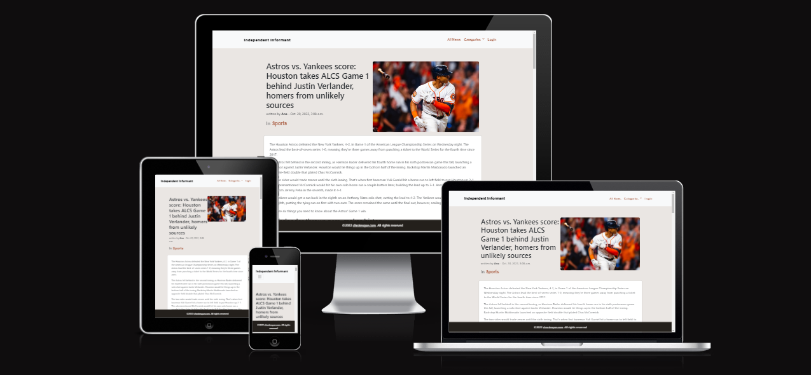 

 

# Table of Contents

1. [Overview](#overview-)
2. [UX](#ux-)
3. [Model/Agile](#modelagile-)
3. [Features](#features-)
4. [Technologies Used](#technologies-used-)
5. [Validation and Testing](#validation-and-testing-)
6. [Deployment](#deployment-)
7. [Credits](#credits-)

 

# **Overview** ([^](#table-of-contents))
Independent Informant is a small article based website that can be used for news or even blogging and features authentication and the ability to comment on articles, including the ability of admins to prevent comments on a per article basis.

 

# **UX** ([^](#table-of-contents))

## Five Planes of UX

### Strategy
- These days many news websites are bogged down by popups, notification windows and all sorts of hindrances that often come before the content is reached. Even within articles there's typically more elements distracting the user and making the user experience worse. Many of these have good reasons to exist, such as GDPR acceptance popups, ads for revenue, etc. The plan of attack here was to put the content first and go for a simplistic base.
- The simplistic nature of the project makes it easy to use for various use cases .

### Scope
- Authentication and basic CRUD functionality for users through comments on articles
- Comment moderation
- Drafting articles before release
- Pagination
- Basic granular sorting of articles in categories

### Structure
- The structure is as simple as it gets, the main navigation contains all necessary functionality apart from commenting on articles
- Commenting on articles is at the bottom of an article, where a discussion might occur
- User authentication status is easily visible at the top right in the navigation, indicated by "Logout"/"Login"

### Skeleton
- The wireframes can be found further down
- The navigation is presented as top centric bar above all content
- Articles are listed as cards with pagination below
- A footer with copyright information at the bottom of the page
- Depending on screen size, the amount of article-cards displayed changes dynamically

### Surface / Design
For colors and fonts I decided to go with the following combination as basis for the project and then used various shades of the light orange seen in the picture below using http://coolors.co

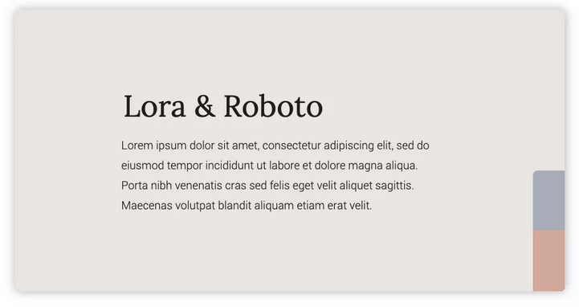

 

## Wireframes

List View of all article headlines / titles

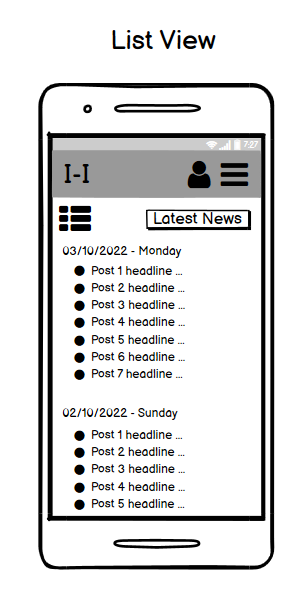

Big Previews of all articles / titles

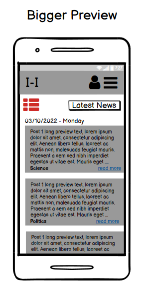

The original idea was to have the ability to change between a title listing and a listing with a bit of a preview of the article contents.

 

Big Preview of a specific category

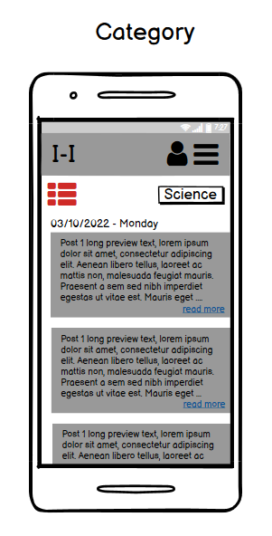

Authentication

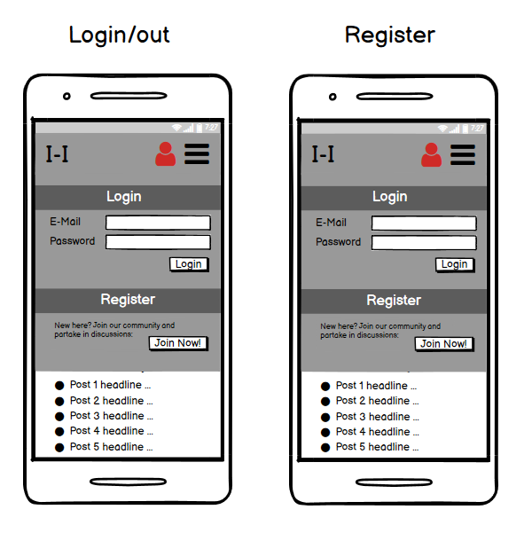

The authentication portion was initially imagined as a popup / hover over the pages content.

 

Navigation listing all available categories

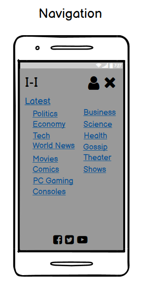

A full post including comment section

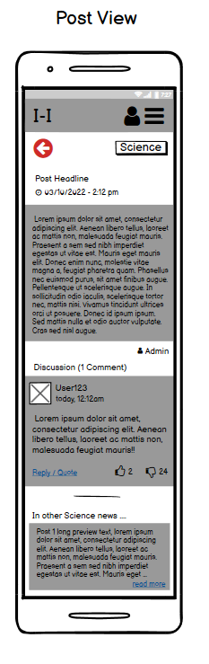

It was planned to have a preview of other articles in the same category listed as well as a like/dislike function.

 

## User Stories
These were the original user stories with slightly different terminology (post = article, etc.)

### Epic: User & Account Management
- Account registration - As a Site User I can register on the site so that I can leave comments on posts
- Account login and logout - As a Site User I can login and logout so that I can decide when to be logged in / out, in case anonymity is sometimes preferred
- Reset password - As a Site User I can reset my password so that set up a new password in case I deem it necessary
- Manage user privileges - As a Site Admin I can manage user privileges so that the ability of an abusive user to leave inappropriate comments can be deactivated
- Manage user rights - As a Site Admin I can manage user rights so that other users can also publish their own posts or at least create them for approval by an admin
- Manage inactive users - As a Site Admin I can purge inactive user accounts so that I can keep the database clean
- Manage suspensions - As a Site Admin I can suspend users either temporaily or permanently so that I can punish bad behaviour

### Epic: Post Interaction
- View list of recent posts - As a Site User I can look at post previews on the main site so that I can open a post that I'm most interested in to read the entire text and/or the conversations in the comments
- View category selection - As a Site User I can see all categories on the site so that I can choose what topic to look at
- View comments on post - As a Site User I can view comments on a post so that I can read the entire discussion
Change comment sorting - As a Site User I can change how comments are sorted so that I can choose to look at the most active comment threads vs. the newest
- Site pagination - As a Site User I can change pages so that see more posts past the 1st page
- Open post - As a Site User I can open a post so that I can read the entire text, not just the preview
- Change display preferences - As a Site User I can hide certain categories so that I can view the posts I'm most interested in
- Quote comments - As a Site User I can quote other users comments so that I can refer to them directly without having to type their response manually

### Epic: Post Administration
- Create post draft - As a Site Admin I can create a post draft so that it can be finished in increments and published later
- Edit posts - As a Site Admin I can edit existing posts and drafts so that mistakes can be correct or revisions made
- Publish post - As a Site Admin I can publish a post draft so that I can take the time to perfect a post before publishing it
- Moderate comments - As a Site Admin I can moderate comments so that I can deal with all kinds of inappropriate comments
- Toggle comment ability - As a Site Admin I can toggle the ability to comment so that I can avoid having to deal with lots of inappropriate comments, depending of the posts topic
- Manage categories - As a Site Admin I can assign and edit categories of posts so that users can easily find posts sorted in categories that they're most interested in

 

# **Model/Agile** ([^](#table-of-contents))

## Model
The original database model was not fully thought through at this stage and not built around the idea of inheritance, which was later remedied with the help of my mentor.

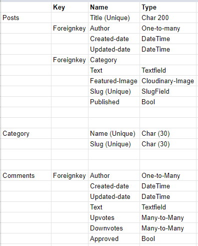

The content of the page is easily divided into **categories**, which are used for **articles** (previously called posts) to be grouped up. Similarly **comments** are also directly linked to their respective articles in which they were left.

Users can be deleted without affecting the functionality of the posted article. Categories cannot be deleted unless all articles linked to it are either moved to another category or deleted. 

Users and authentication is being handled through allauth.

## Agile
Github Projects were used during the development of this project. Labels were used for should-have, could-have, wont-have statuses as well as to make Epics, User Stories and Tasks easier to distinguish.
Tasks are linked to their User Stories, User Stories are linked to their Epics in the description.

 

# **Features** ([^](#table-of-contents))

- Authentication is being handled through allauth (see Technologies used further down), the website can be used entirely without login but a login is required to comment on articles and subsequently to edit and delete a users own comments

- The navigation groups up all categories which are pulled from the database, as all articles are categorized

    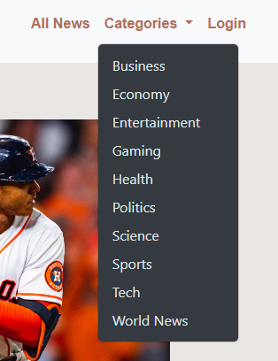

- The main page / index lists all articles sorted by date, regardless of category

    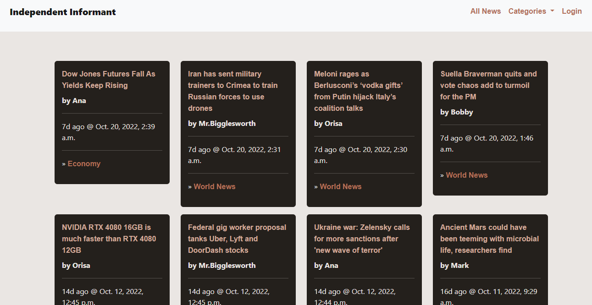

- The category specific pages list all category-relevant articles sorted by date

    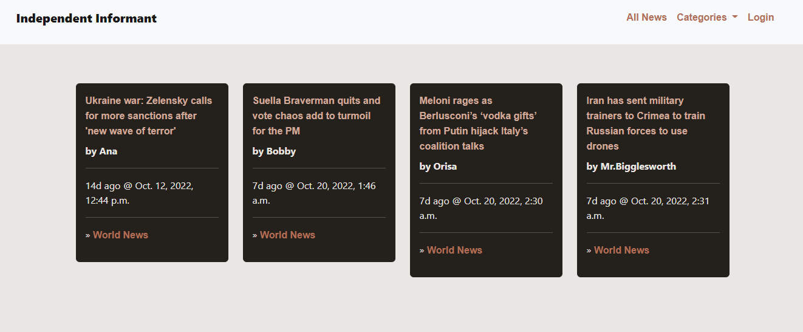

- Articles can have 3 different comment modes:
    - Off: no comments allowed, for controversial topics that inevitably lead to trolls, hate and all kinds of behaviour typically best avoided entirely

    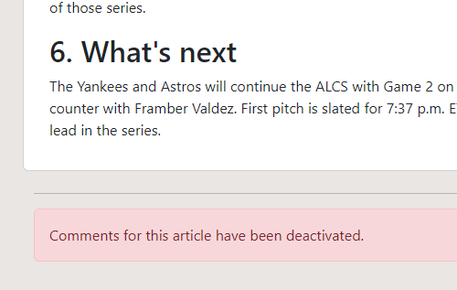

    - Mod: comments have to be approved first, before they are shown

    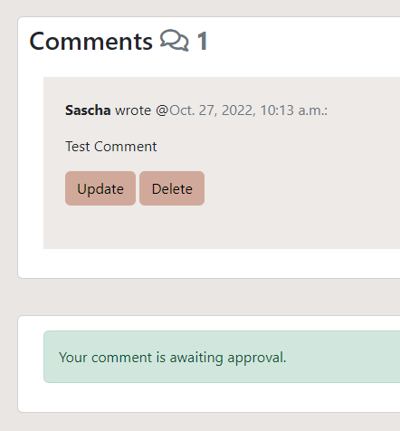

    - AAC: Auto approve comments, every comment posted will be visible right away - this is the default mode for all articles and can be changed on a per article basis

    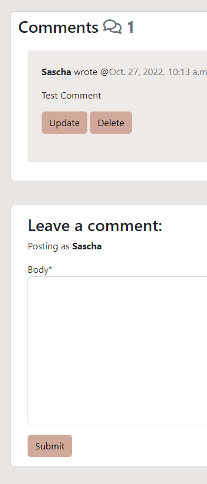

- A logged in user has the option to edit and delete their own comments, if they so choose

    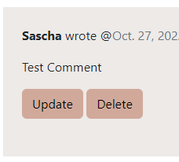

- All administrative work of creating, editing and deleting articles and categories can be done through the standard Django admin panel, that also includes the moderation of comments

    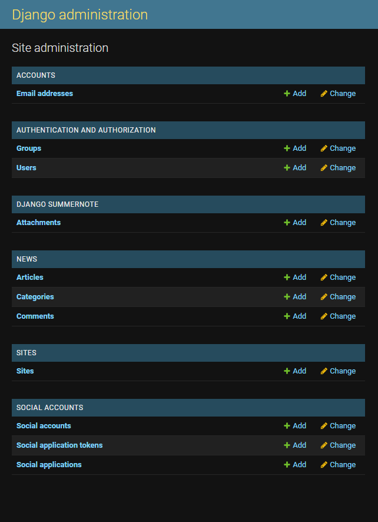

- All relevant user actions have an alarm popup to give feedback to the user of successful actions 

    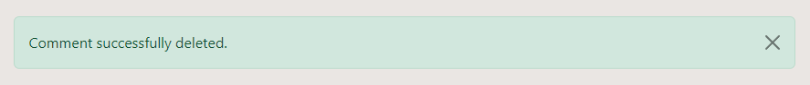

 

# **Technologies Used** ([^](#table-of-contents))

## Languages
- <a href="https://en.wikipedia.org/wiki/HTML5" target="_blank">HTML5</a>
- <a href="https://en.wikipedia.org/wiki/Cascading_Style_Sheets" target="_blank">CSS3</a>
- <a href="https://en.wikipedia.org/wiki/JavaScript" target="_blank">Javascript</a>
- <a href="https://en.wikipedia.org/wiki/Python_(programming_language)" target="_blank">Python</a>

## Frameworks
- <a href="https://www.djangoproject.com/" target="_blank">Django 3.2.16</a>
- <a href="https://getbootstrap.com/" target="_blank">Bootstrap</a>

## Django-Packages
- <a href="https://pypi.org/project/psycopg2/" target="_blank">psycopg2 v2.9.3</a>
- <a href="https://docs.gunicorn.org/en/latest/deploy.html" target="_blank">gunicorn v20.1.0</a>
- <a href="https://github.com/summernote/django-summernote" target="_blank">django-summernote v0.8.20.0</a>
- <a href="https://cloudinary.com/documentation/django_integration" target="_blank">cloudinary v1.30.0</a> 
- <a href="https://github.com/mrts/django-admin-list-filter-dropdown" target="_blank">django-admin-list-filter-dropdown v1.0.3</a>
- <a href="https://django-allauth.readthedocs.io/en/latest/installation.html " target="_blank">django-allauth 0.51.0</a>
- <a href="https://django-crispy-forms.readthedocs.io/en/latest/" target="_blank">crispy-forms 1.14.0</a>

## Other
- <a href="https://fonts.google.com/" target="_blank">Google Fonts</a> used for fonts throughout the whole site
- <a href="https://git-scm.com/" target="_blank">Git</a> used for version control through the Gitpod terminal for deployment onto Github
- <a href="https://github.com/" target="_blank">GitHub</a> used as host and for deployment of the site
- <a href="http://gitpod.com" target="_blank">Gitpod</a> used as IDE
- <a href="https://validator.w3.org/" target="_blank">W3C Markup Validation Service</a> used to validate HTML code
- <a href="https://jigsaw.w3.org/css-validator/" target="_blank">W3c CSS Validation Service</a> used to validate CSS code
- <a href="https://jshint.com/" target="_blank">JSHint</a> used to analyze and error correct the Javascript code
- <a href="https://color.a11y.com/" target="_blank">a11y Color Contrast Accessibility Validator</a> used to validate contrast accessibility
- <a href="https://www.adobe.com/products/photoshop.html" target="_blank">Adobe Photoshop 2021</a> used for the creation of graphics
- <a href="https://lettercounter.github.io/" target="_blank">Lettercounter</a> used to keep commit messages below or at 50 characters
- <a href="http://ami.responsivedesign.is/" target="_blank">Am I Responsive?</a> used to create responsive preview of the site used at the top of this readme
- <a href="https://coolors.co/" target="_blank">Coolors</a> used to create a color palette for this project
- <a href="https://balsamiq.com/" target="_blank">Balsamiq</a> used to create the wireframes during the initial design stage

 

# **Validation and Testing** ([^](#table-of-contents))

## W3C Markup Validation Service
- No Errors found on all pages

## W3c CSS Validation Service
- No Errors found on my static/css/style.css file

## Javascript - JSHint
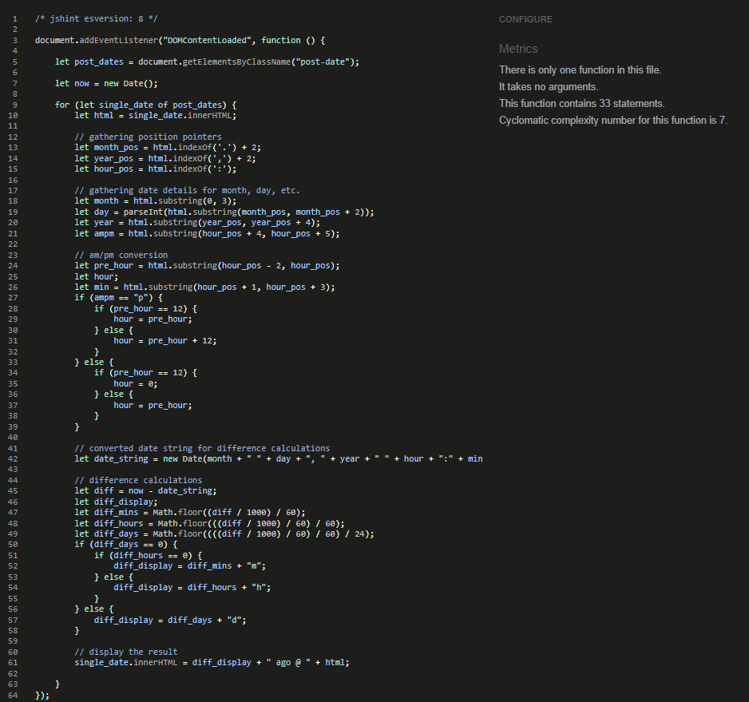
- A single self-created Javascript file is in place and was tested manually.

## Python
- With http://pep8online.com/ being broken, I relied on the Gitpod template (listed in Credits) and its built-in PEP8 linter
- Django TestCase tests were used to automatically test functionality of the **form**:
    - fields are explicit
    - body field is required
- The **views** (most of which also check for correct template usage):
    - database driven categories are listed in base.html
    - article list (index) loads correctly
    - categories list only their own articles and loads correctly
    - article detail view loads correctly
    - a logged in user can post comments on an article
    - the same user can edit their comments
    - the same user can delete their comments
- The **models**:
    - categories can be created
    - category length limitation works
    - articles can be created
    - articles have a default for the comment mode (auto approve comments)
    - comments can be created
    - models inherit from the commonfield class successfully
    - foreignkeys are correctly used

All automated tests work flawlessly:

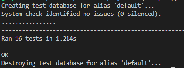 

 

## a11y Color Contrast Accessibility Validator
- No color contrast issues were found.

## Google Lighthouse

Desktop - Listing of articles

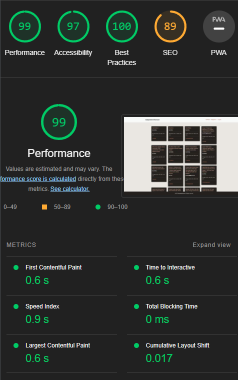

Mobile - Listing of articles

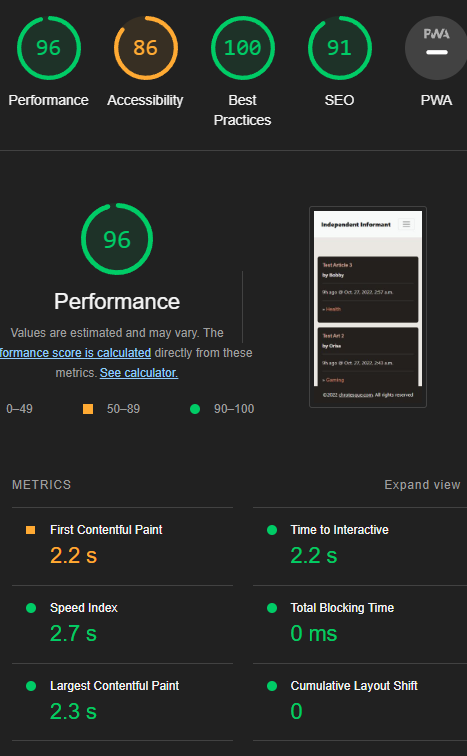

Desktop - Detailed view of an article

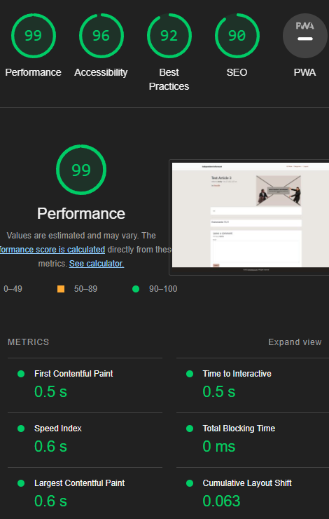

Mobile - Detailed view of an article

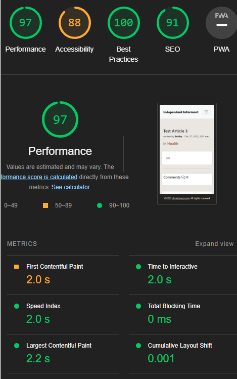

 

# **Deployment** ([^](#table-of-contents))

In order to create a clone of the repository, Github has created a handy guide right <a href="https://docs.github.com/en/repositories/creating-and-managing-repositories/cloning-a-repository#cloning-a-repository-to-github-desktop" target="_blank">here</a>.

Heroku was used to deploy the project, as such:
1. Login to <a href="https://id.heroku.com/login" target="_blank">Heroku</a>
1. Click on New > Create new app on the top right of your <a href="https://dashboard.heroku.com/apps">Dashboard</a>
1. Enter the App name, select your region and click on "Create App"
1. On the tab "Resources" add the "Heroku Postgres" database to your App
1. On the tab "Settings" find "Config Vars" and click "Reveal Config Vars"
1. Add the following Key / Value pairs:
    - Port / 8000
    - SECRET_KEY / <your_secret_key> from settings.py
    - CLOUDINARY_URL / <your_cloudinary_url>**1
    - DATABASE_URL / <your_database_url>**2
1. Further down add heroku/python in the "Buildpacks" section
1. On the tab "Deploy" select Github as the deployment option, connect to the respective Github repository
1. Further down you can then deploy either manually per branch or automatically
1. Once deployed, click "Open app" at the top right to open the deployed site

**1 # **Cloudinary URL**
1. Login to <a href="https://cloudinary.com/users/login" target="_blank">Cloudinary</a>
1. The Cloudinary URL can be found on the <a href="https://cloudinary.com/console" target="_blank">Dashboard</a>, which should load right after login
1. The API Environment variable can be found right there, through hovering on the field you can click the copy button to use it as <your_cloudinary_url>
1. The copied string already contains both key and value

**2 # **PostGres Database URL**
1. On the "Resources" tab, click on the database to open it
1. On the database UI, change tab from "Overview" to "Settings"
1. Click on the "View Credentials..." button to reveal the URI, this is <your_database_url>

 

# **Credits** ([^](#table-of-contents))

- <a href="https://github.com/Code-Institute-Org/gitpod-full-template" target="_blank">Gitpod template</a> by <a href="https://codeinstitute.net/global/" target="_blank">Code Institute</a> to get started with the project

### Media
- The placeholder picture was created by me, including the favicon
- All other pictures were taken from <a href="https://www.pexels.com/" target="_blank">pexels</a> 

### Code

- Bootstrap and Python code was based off of Code Institutes Programmes "Hello Django" and "I Think Therefore I Blog" to have a starting point. The code was then modified to fit this projects needs. New code was also introduced that cannot be found in those programmes. 

### Thanks
- Code Institutes Student Care helped tremendeously during a rather difficult time and gave me the time and space to finish this project